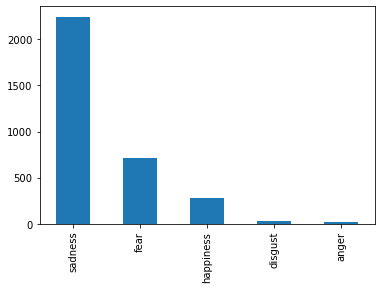
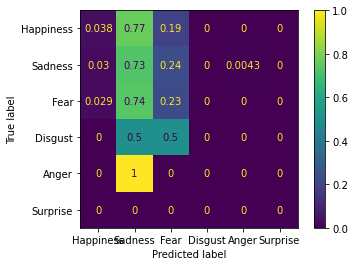
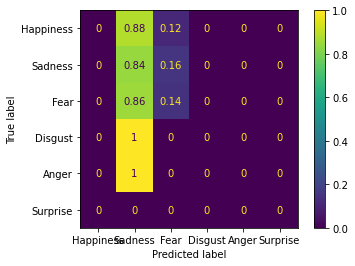
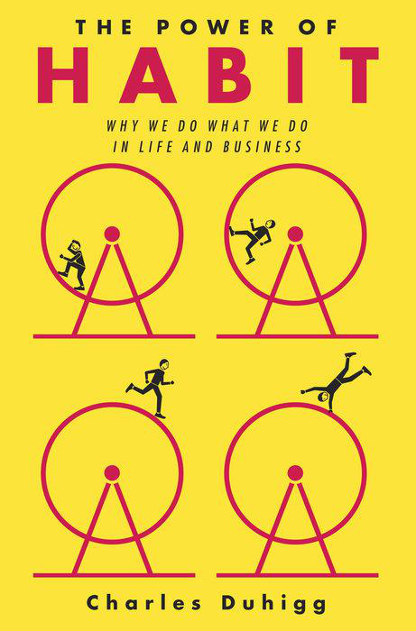
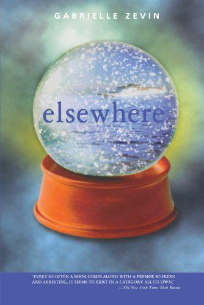
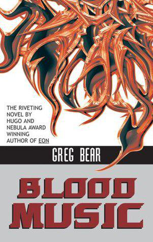

# Judging a Book by it Cover

## Introduction

In this project, I attempt to solve the problem of applying sentiment analysis to book covers, using the cover images of different books to predict the emotional content of the text. Currently, senti- ment analysis is very focused on textual analysis, such as finding the emotional intent behind posts on social media. I believe that it is possible to expand sentiment analysis on images. Book covers provide an interesting new area to explore. Books, by nature, involve much more nuanced emotional cues than food reviews or social media posts, and book covers are designed to give potential readers a hint as to the contents, despite admonitions “not to judge a book by its cover.”

To create the dataset for this project, I draw on the book information provided by the Goodreads website. According to the company’s ‘About Us’ page, “Goodreads is the world’s largest site for readers and book recommendations.” [1] In particular, it collects information about books – including titles, covers, and reviews – and allows users to provide commentary on books for other users to see. I scrape the Goodreads website to build a database of book cover images and user-created labels that serve as emotional classifications. The resulting dataset has significant imbalances in the different emotional classes.

I primarily experiment with the ResNet-50 model, a specific type of convolutional neural network (CNN) introduced in the 2015 paper “Deep Residual Learning for Image Recognition” by He Kaiming, Zhang Xiangyu, Ren Shaoqing, and Sun Jian and implemented in the TensorFlow library. The bulk of my work is about testing out various approaches to making ResNet-50 more robust against the imbalances in my dataset.

## Repo Structure Outline

```
+
|- README.md # this file
|- BinaryToMulti.ipynb # Final file with two-part model (binary classification on SAD/NOT_SAD, then HAPPY/FEAR, with ResNet-50 + SMOTE + Focal Loss) training and testing
|- BinaryToMultiWithNorm.ipynb # Attempt for two-part model training and testing with normalization
|- ModelEvaluation.ipynb # Initial code for evaluating each model in aggregate and by emotional category
|- ModelEvaluation2.ipynb # Final code for evaluating each model in aggregate and by emotional category, with greater visualization
|- ModelTestingv1.ipynb # Initial round of model experimentation (ResNet-50, ResNet-50 with oversampling, ResNet-50 with SMOTE, ResNet-50 with undersampling, ResNet-50 with focal loss)
|- ModelTestingv2.ipynb # Further round of model experimentation (ResNet-50 with normalization, ResNet-50 with normalization and focal loss)
|- VGG.ipynb # Model experimentation with VGG-16 and VGG-16 with oversampling
|- VGG_terminal.py # Extra code for running VGG-16 in the event that Jupyter Lab is unable to allocate memory for testing purposes
|- md_images # Folder for images for README
|+ Data # Folder for various data collection and exploration
 |- EDA.ipynb # Exploratory Data Analysis, file for carrying out preliminary explorations of data and creating persistent train/test splits
 |- Scraping.ipynb # File for web scraping of Goodreads and retrieving relevant book data
```

## Work

First, I decided on the emotional categories that I would classify models into. I then collected data from Goodreads and separated the data into those categories. I explored the data, discovering major imbalances, and I experimented with the popular image-classifier CNNs ResNet-50 and VGG-16. I finally sought ways to mitigate the problems raised by the data imbalances, including undersampling, oversampling, and SMOTE.

### Categorizing Emotions
I decided to use the emotion categories defined by the psychologist Paul Ekman: Happiness, Sadness, Fear, Disgust, Anger and Surprise. [5] This seemed to be an intuitive division of books, particularly considering the different genres available. Tragedies fit naturally into Sadness, horror novels fit naturally into Fear, and suspenseful stories that heavily use twists and unexpected plot developments will probably be seen as Surprise.
    
### Collecting Data

I initially started by exploring popular datasets of books from a variety of sources, such as on Kaggle. However, I quickly found that most book data, including datasets built using Goodreads, included text data on the books – such as titles, descriptions, and ratings – but not cover images. This is probably to limit the size of datasets.

To get around this, I started with the Goodreads website, which provides large collections of books into categories based on popularity and genre. Since nearly every book came with a cover image on the website, I planned to use the Python libraries urlopen and BeautifulSoup to scrape book covers from the website.

I also needed to categorize the book images. To this end, I decided to use ‘shelves.’ Shelves are a feature of the Goodreads website where users can add simple descriptors to a book, such ‘fun’ or ‘scary.’ Each book has a shelves page, and by using the Python selenium library, I was able to scrape each book’s shelves in order of the number of users who had added that tag to each book.

To that end, I built a set of synonyms for each of the emotional categories, and then I used a simple Python function to find the first synonym I had flagged as important in each book’s shelves. Since these were ordered by the number of times they were used, I was able to get the most popular descriptor for each book which could be linked to a specific emotional category. The category which the synonym came from then became the label for the book. This created a dataset composed of book covers and emotional categories as labels.

For the initial scraping, I got my books from Goodreads’s ‘Best Books Ever’ List, since these seemed to be the most popular, and I thought that these might have the most user engagement and, thus, the most user tags. For the dataset, the inputs were only the book cover images - shrunk to identical dimensions - and the classifications labels were the most-used emotion labels.


### Data Exploration
After accounting for books that did not have usable shelves or broken image links, I had a dataset of 3289 samples. This seemed to be a promisingly large sample size. However, upon further exploration, I found a serious issue.

||
| ---- |
|*Bar graph showing number of samples per emotional category.*|

As the graph shows, there are serious imbalances in the number of samples for each emotional category. Books labeled as sad make up the majority of the dataset, books tagged with ‘fear’ make up a majority of the books left, and so on.

### Initial Approach
Based on the related works that I had read, I decided to start by applying ResNet-50 to the classification problem to see how well the model would be able to predict the labels of the book cover data without major modifications. I also decided to experiment with VGG-16, a much larger CNN, to see how larger model sizes would affect performance.

This led to the following results:
| | Test Accuracy	| Epoch Count | Time per Epoch |
| ---------------- | --------------- | --------------- | ------------ |
| ResNet-50 | 0.6200607902735562 | 25 |  3005 |
| VGG-16  | 0.6231003039513677 | 25 & 1180 |

I found little difference between the two models in overall accuracy. In addition, when looking at confusion matrices of the results:

|||
| ---- | ---- |
|*Confusion matrix of ResNet-50 outputs.*|*Confusion matrix of VGG-16 outputs.*|

It seemed clear that the Sadness label was being selected too frequently.

 
### Responding to Data Imbalances
I first approached the problem of resolving the data imbalances by applying undersampling, oversampling, and the Synthetic Minority Oversampling Technique (SMOTE). Undersampling is a technique to balance data by keeping all samples in minority classes and getting rid of samples in large classes. Oversampling seeks to do the opposite by introducing more samples to the minority classes. In my case, I randomly sampled from the existing minority classes with replacement to get a more even distribution of data. Finally, SMOTE is a specialized oversampling technique synthesizes new samples from existing samples, effectively creating more data points based on the old ones.

In addition to trying to fix problems in the data, I tried to tailor the models to be more responsive to the differences in the data distribution. In my case, I applied focal loss – particularly Focal Cross Entropy Loss – to get the model to weight incorrect predictions for minority classes more heavily.

Finally, I tried to alter the plan more thoroughly in response to the problems I ran into. Based on the results of my previous experimentation, I created a more complex prediction process. I first turned the problem from a multiclass classification into a binary classification problem, only predicting if a book was tagged as sad or not sad. For the books tagged as not sad, I then created another model to predict if they were classified fear or happiness. I dropped disgust and anger entirely, since there were so few in the dataset. This created a two-model pipeline for predicting whether a book is sad, happy, or scary.

## Results

My overall results for each model that I tested are below:

| | ResNet-50 | ResNet-50 (Undersampled) | ResNet-50 (Oversampled) | ResNet-50 (SMOTE) | ResNet-50 (Normalized) | ResNet-50 (Focal Loss) | VGG-16 | VGG-16 (Oversampled) |
| -- | -- | -- | -- | -- | -- | -- | -- | -- |
| Test Accuracy | 0.5623100303951368 | 0.0060790273556231 | 0.5835866261398176 | 0.6200607902735562 | 0.6443768996960486 | 0.7021276595744681 | 0.6231003039513677 | 0.601823708206687 |
| Sadness Accuracy | 0.7272727272727273 | 0.004329004329004329 | 0.7619047619047619 |  0.8484848484848485 | 0.8961038961038961 | 1.0 | 0.8441558441558441 | 0.8225108225108225 |
| Fear Accuracy | 0.2318840579710145 | 0.0 | 0.2028985507246377 |  0.10144927536231885 | 0.07246376811594203 | 0.0| 0.14492753623188406 | 0.10144927536231885|
| Happiness Accuracy | 0.038461538461538464 | 0.0 | 0.07692307692307693 | 0.038461538461538464 |  0.0 | 0.0 | 0.0 | 0.038461538461538464 |
| Disgust Accuracy | 0.0 | 0.0 | 0.0 | 0.0 |  0.0 | 0.0 | 0.0 | 0.0 |
| Anger Accuracy | 0.0 | 0.0 | 0.0 | 0.0 | 0.0 | 0.0 | 0.0 | 0.0 |

Looking at the accuracy scores, it seems apparent that the models lean towards applying ‘sadness’ to every category as much as possible, even when attempting to rebalance the dataset. Undersampling is by far the weakest approach, completely damaging any possible training on the model. Oversampling and SMOTE seem to do much better, while focal loss results in net improvement at the expense of any category that is not ‘sadness.’ SMOTE and normalization seem to have been the most successful at both overall accuracy and improving individual category accuracies.

Based on these results, I decided to construct my final model from ResNet-50 using a focal loss function and applying SMOTE to the data. As discussed previously, I dropped the disgust and anger samples, and divided the problem into two binary classification problems. I first trained one model to decide between ‘sad’ and ‘not-sad’ samples, and I trained another model to determine, within the ‘not-sad’ samples, between ‘fear’ and ‘happy’ samples. The results are below:

| | ResNet-50 |
| -- | -- |
| Test Accuracy | 0.9513677811550152 |
| Sadness Accuracy | 0.9783549783549783 |
| Fear Accuracy | 0.9420289855072463 |
| Happiness Accuracy | 0.8461538461538461 |

These results were extremely gratifying, as they showed the models finally demonstrating meaningful improvements in their ability to predict ‘fear’ and ‘happy’ samples without being swamped by ‘sad’ samples. This is particularly clear in when illustrated through confusion matrices.


### Sample Predictions

The following are examples of classifications from the two-part model on the testing dataset.

||||
| ---- | ---- | ---- |
|Goodreads-derived emotion: Happiness<br />Predicted emotion: Happiness|Goodreads-derived emotion: Sadness<br />Predicted emotion: Sadness|Goodreads-derived emotion: Fear<br />Predicted emotion: Fear|

## Reflection and Next Steps

I am very surprised at the effectiveness of my final two-model process, and I made sure to reverse-search the results to make sure that I had not accidentally produced incorrect results.

The ‘sadness’ category remained the most easily identifiable category for the model, which makes sense, since that was always the largest category. Then, between ‘fear’ and ‘happiness’, the model was significantly more accurate with ‘fear’ than with ‘happiness,’ again performing better with the larger sample size.

Overall, the results seem to indicate that there are recognizable differences between the cover images for books, as categorized by users based on the emotional responses those books elicited from them. However, while my double-binary-classification approach yielded interesting results, I do not think that this is an easily scalable approach for wider image classification of sentiment analysis problems. As a result, I want to explore some possibilities on how I would improve and expand this project if I were still working on it.

The first thing that I would do is try to expand the dataset. To get my final results, I had to drop two emotional categories, and one – ‘surprise’ – I simply never found any samples for in my initial scrape. In the future, I might deliberately get a wider sample of data and collect the most popular responses for each category, rather than getting the most popular books and categorizing them afterwards.

It would also be possible to provide a more complex distribution of book inputs. For instance, a more detailed analysis of user tags on Goodreads might provide inputs on how many users tagged a book for each category. This could be used to create a dataset where every book has a ‘score’ for how strongly the book is associated with each emotional category, allowing for more nuanced training and outputs by the model.

Of course, it would also be useful to get information on books from other sources. Amazon, for instance, has a similarly large book database, and it might also be possible to create judgments of books based on reviews by professional reviewers.

In terms of the models used, I am quite happy with the performance of ResNet-50, but further iterations with ResNet models, along with versions of VGG and non-CNN models, would be worth exploring.

Finally, I believe that the scope of this project could be further expanded. It might be possible, for instance, to include more complexity in the emotional labels, such as entirely new emotions like whimsical and unsettling; I also thought that this might be applicable to movie posters, which have many of the same qualities as book covers since they are both trying to give viewers a sense of 'inner' content.

Ultimately, I believe that this project shows that there is potential in machine learning to apply sentiment analysis to non-text data samples. Images are not just representations of objects but are frequently designed to provide emotional experiences and elicit certain responses in viewers; this is what makes painting, photography, and drawing all art forms. I expect that applying developments in image classification will provide a way forward to identify the feelings in images as well as the shapes.
